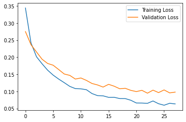
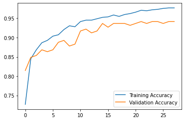
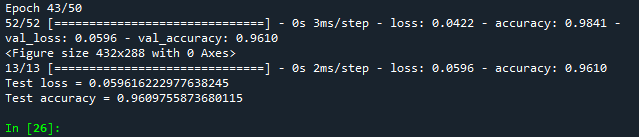

# Github Project 1 - Heart Disease Prediction

 1. You are going to predict whether a patient has heart disease or not

 2. LINK to the dataset 
 
      https://www.kaggle.com/datasets/johnsmith88/heart-disease-dataset

 3. Criteria :
 
    a. The model should reach at least 90% accuracy for both training and validation.
    
    b. The model should not overfit 
    (validation loss needs to be within 10% difference with the training loss)
    
 4. You required to upload onto your Github
 
 
 
 
 
 
 
